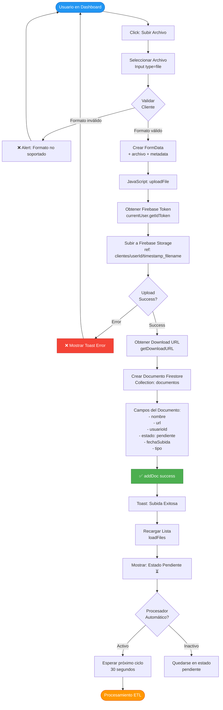
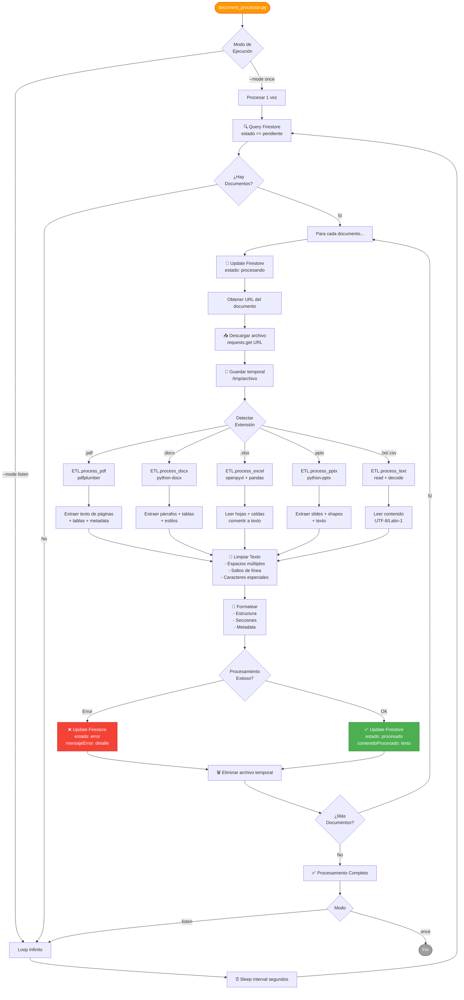
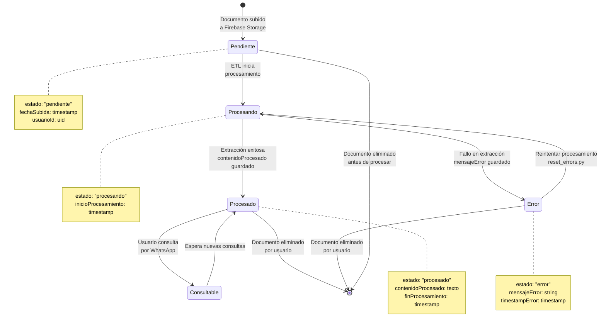
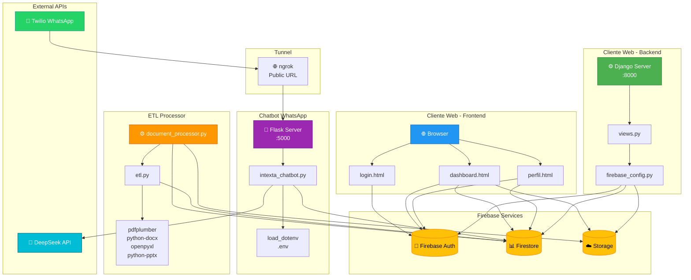

# 📊 Diagrama de Flujo - Sistema Intexta

Este documento contiene diagramas de flujo completos del sistema Intexta, desde la carga de documentos hasta la consulta por WhatsApp.

---

## 🔄 Flujo Completo del Sistema

```mermaid
flowchart TD
    Start([👤 Usuario]) --> Login{¿Autenticado?}
    
    Login -->|No| Register[📝 Registro/Login<br/>Firebase Auth]
    Register --> EmailVerify[📧 Verificación Email]
    EmailVerify --> Login
    
    Login -->|Sí| Dashboard[📊 Dashboard]
    
    Dashboard --> Choice{Acción del<br/>Usuario}
    
    Choice -->|Subir Documento| Upload[📤 Seleccionar Archivo<br/>PDF/DOCX/XLSX/PPTX]
    Choice -->|Vincular WhatsApp| Profile[👤 Ir a Perfil]
    Choice -->|Consultar| WA[📱 WhatsApp]
    
    %% FLUJO DE SUBIDA Y PROCESAMIENTO
    Upload --> ValidateFile{¿Formato<br/>Válido?}
    ValidateFile -->|No| ErrorMsg[❌ Mostrar Error]
    ErrorMsg --> Dashboard
    
    ValidateFile -->|Sí| FirebaseUpload[☁️ Subir a Firebase Storage<br/>clientes/userId/archivo]
    FirebaseUpload --> CreateDoc[📝 Crear Documento en Firestore<br/>estado: pendiente]
    CreateDoc --> ShowPending[⏳ Mostrar: Pendiente]
    
    ShowPending --> AutoProcess{Procesador<br/>Automático<br/>Activo?}
    
    AutoProcess -->|No| ManualTrigger[⚙️ Trigger Manual<br/>document_processor.py]
    AutoProcess -->|Sí| WaitInterval[⏰ Esperar 30s]
    
    ManualTrigger --> ETLStart
    WaitInterval --> CheckPending{¿Hay Docs<br/>Pendientes?}
    CheckPending -->|No| WaitInterval
    CheckPending -->|Sí| ETLStart
    
    ETLStart[🔄 Iniciar ETL<br/>estado: procesando] --> DownloadFile[📥 Descargar desde Storage]
    DownloadFile --> DetectType{Tipo de<br/>Archivo}
    
    DetectType -->|PDF| ExtractPDF[📄 pdfplumber<br/>extraer texto]
    DetectType -->|DOCX| ExtractDOCX[📝 python-docx<br/>extraer texto]
    DetectType -->|XLSX| ExtractXLSX[📊 openpyxl<br/>extraer datos]
    DetectType -->|PPTX| ExtractPPTX[🎨 python-pptx<br/>extraer texto]
    DetectType -->|TXT/CSV| ExtractTXT[📃 leer texto plano]
    
    ExtractPDF --> ProcessText[🧹 Limpiar y Procesar<br/>Texto]
    ExtractDOCX --> ProcessText
    ExtractXLSX --> ProcessText
    ExtractPPTX --> ProcessText
    ExtractTXT --> ProcessText
    
    ProcessText --> SaveFirestore[💾 Guardar en Firestore<br/>contenidoProcesado<br/>estado: procesado]
    SaveFirestore --> UpdateDashboard[🔄 Actualizar Dashboard<br/>✅ Procesado]
    UpdateDashboard --> Dashboard
    
    %% FLUJO DE VINCULACIÓN WHATSAPP
    Profile --> EnterPhone[📱 Ingresar Teléfono<br/>ej: 930104972]
    EnterPhone --> SavePhone[💾 Guardar en Firestore<br/>usuarios/uid/telefono]
    SavePhone --> PhoneSaved[✅ Teléfono Vinculado]
    PhoneSaved --> Dashboard
    
    %% FLUJO DE CONSULTA WHATSAPP
    WA --> SendMessage[💬 Enviar Mensaje<br/>a Twilio Sandbox]
    SendMessage --> TwilioReceive[📨 Twilio Recibe<br/>Mensaje]
    TwilioReceive --> WebhookCall[🌐 POST a Webhook<br/>ngrok → localhost:5000]
    
    WebhookCall --> ChatbotReceive[🤖 intexta_chatbot.py<br/>Recibe Mensaje]
    ChatbotReceive --> ExtractPhone[📞 Extraer Número<br/>from: whatsapp:+56930104972]
    
    ExtractPhone --> CheckAuth{¿Usuario<br/>Autenticado?}
    
    CheckAuth -->|No| SearchUser[🔍 Buscar en Firestore<br/>usuarios.telefono]
    SearchUser --> UserFound{¿Usuario<br/>Encontrado?}
    
    UserFound -->|No| SendAuthMsg[📤 Mensaje: Registrarse<br/>y Vincular Teléfono]
    SendAuthMsg --> TwilioSend[📲 Twilio Envía<br/>Respuesta]
    TwilioSend --> UserReceives[📱 Usuario Recibe<br/>Mensaje]
    UserReceives --> End([Fin])
    
    UserFound -->|Sí| CacheUser[💾 Cachear Usuario<br/>usuarios_autenticados]
    CacheUser --> CheckAuth
    
    CheckAuth -->|Sí| GetDocs[📚 Obtener Documentos<br/>Firestore Query]
    GetDocs --> HasDocs{¿Tiene<br/>Documentos?}
    
    HasDocs -->|No| SendNoDocsMsg[📤 Mensaje: Subir<br/>Documentos]
    SendNoDocsMsg --> TwilioSend
    
    HasDocs -->|Sí| BuildContext[🧠 Construir Contexto<br/>de Documentos]
    BuildContext --> CheckCommand{¿Comando<br/>Especial?}
    
    CheckCommand -->|/ayuda| SendHelp[📖 Mensaje de Ayuda]
    CheckCommand -->|/reset| ResetConv[🔄 Reiniciar<br/>Conversación]
    CheckCommand -->|Pregunta| PrepareAI
    
    SendHelp --> TwilioSend
    ResetConv --> TwilioSend
    
    PrepareAI[🎯 Preparar Prompt<br/>para IA] --> BuildMessages[📝 Construir Mensajes<br/>System + Context + User]
    BuildMessages --> CallDeepSeek[🚀 Llamar DeepSeek API<br/>deepseek-chat]
    
    CallDeepSeek --> DeepSeekProcess[🤖 IA Procesa<br/>Contexto + Pregunta]
    DeepSeekProcess --> GenerateResponse[✨ Generar Respuesta<br/>Basada en Documentos]
    
    GenerateResponse --> SaveHistory[💾 Guardar en Historial<br/>conversaciones[phone]]
    SaveHistory --> FormatResponse[📝 Formatear Respuesta<br/>para WhatsApp]
    FormatResponse --> TwilioSend
    
    style Start fill:#4CAF50,stroke:#2E7D32,color:#fff
    style End fill:#F44336,stroke:#C62828,color:#fff
    style Dashboard fill:#2196F3,stroke:#1565C0,color:#fff
    style ETLStart fill:#FF9800,stroke:#E65100,color:#fff
    style ChatbotReceive fill:#9C27B0,stroke:#6A1B9A,color:#fff
    style CallDeepSeek fill:#00BCD4,stroke:#006064,color:#fff
    style SaveFirestore fill:#4CAF50,stroke:#2E7D32,color:#fff
```

---

## 📤 Flujo Detallado: Subida de Documentos



---

## ⚙️ Flujo Detallado: Procesamiento ETL



---

## 💬 Flujo Detallado: Chatbot WhatsApp

```mermaid
flowchart TD
    Start([Usuario envía mensaje]) --> Twilio[📨 Twilio Recibe<br/>From: whatsapp:+56930104972<br/>Body: ¿Qué documentos tengo?]
    
    Twilio --> Webhook[🌐 POST a Webhook<br/>https://xxx.ngrok-free.app/webhook]
    Webhook --> Flask[🤖 Flask recibe request<br/>@app.route /webhook POST]
    
    Flask --> Extract[📝 Extraer datos<br/>phone = request.form From<br/>msg = request.form Body]
    Extract --> Normalize[🔧 Normalizar teléfono<br/>whatsapp:+56930104972<br/>→ +56930104972]
    
    Normalize --> CheckCache{¿En caché<br/>usuarios_autenticados?}
    
    CheckCache -->|No| QueryFirestore[🔍 Query Firestore<br/>usuarios.telefono == phone]
    QueryFirestore --> Formats[Probar formatos:<br/>+56930104972<br/>56930104972<br/>930104972]
    
    Formats --> Found{¿Usuario<br/>Encontrado?}
    Found -->|No| ResponseAuth[📤 Respuesta:<br/>Registrarse en web<br/>y vincular teléfono]
    ResponseAuth --> SendTwilio
    
    Found -->|Sí| CacheUser[💾 Cachear:<br/>usuarios_autenticados phone = uid]
    CacheUser --> CheckCache
    
    CheckCache -->|Sí| GetUID[Obtener UID del caché]
    GetUID --> QueryDocs[📚 Query Firestore<br/>documentos.usuarioId == uid<br/>estado == procesado]
    
    QueryDocs --> HasDocs{¿Tiene<br/>Documentos?}
    HasDocs -->|No| ResponseNoDocs[📤 Respuesta:<br/>No tienes documentos<br/>Sube desde la web]
    ResponseNoDocs --> SendTwilio
    
    HasDocs -->|Sí| ExtractContent[📄 Extraer contenidoProcesado<br/>de cada documento]
    ExtractContent --> BuildContext[🧠 Construir contexto:<br/>=== DOC 1 ===<br/>contenido...<br/>=== DOC 2 ===<br/>contenido...]
    
    BuildContext --> CheckSpecial{¿Comando<br/>Especial?}
    CheckSpecial -->|/ayuda| HelpMsg[📖 Mensaje ayuda:<br/>Comandos disponibles]
    CheckSpecial -->|/reset| ResetMsg[🔄 Resetear:<br/>conversaciones phone = ]
    
    HelpMsg --> SendTwilio
    ResetMsg --> SendTwilio
    
    CheckSpecial -->|Pregunta normal| LoadHistory[📜 Cargar historial:<br/>conversaciones phone]
    LoadHistory --> PrepareMessages[📝 Construir mensajes para IA]
    
    PrepareMessages --> SystemPrompt[Sistema:<br/>Eres Intexta, asistente experto<br/>Responde basándote SOLO en docs<br/>Respuestas cortas para WhatsApp]
    
    SystemPrompt --> ContextMsg[Contexto:<br/>Contenido de los documentos]
    ContextMsg --> UserHistory[Historial:<br/>Últimos 5 mensajes<br/>user/assistant]
    UserHistory --> CurrentMsg[Mensaje actual:<br/>user: pregunta]
    
    CurrentMsg --> CallAPI[🚀 POST a DeepSeek API<br/>https://api.deepseek.com/v1/chat]
    CallAPI --> Headers[Headers:<br/>Authorization: Bearer API_KEY<br/>Content-Type: application/json]
    
    Headers --> Payload[Payload:<br/>model: deepseek-chat<br/>messages: array<br/>temperature: 0.7<br/>max_tokens: 500]
    
    Payload --> DeepSeek[🤖 DeepSeek Procesa]
    DeepSeek --> APIResponse[📥 Respuesta API:<br/>choices 0 .message.content]
    
    APIResponse --> SaveConversation[💾 Guardar en historial:<br/>conversaciones phone .append<br/>role: user, content<br/>role: assistant, content]
    
    SaveConversation --> FormatWA[📝 Formatear para WhatsApp:<br/>Max 1600 caracteres<br/>Emojis permitidos]
    
    FormatWA --> SendTwilio[📲 Twilio Response<br/>MessagingResponse]
    SendTwilio --> UserReceives[📱 Usuario recibe<br/>respuesta en WhatsApp]
    
    UserReceives --> End([Fin])
    
    style Start fill:#4CAF50,stroke:#2E7D32,color:#fff
    style CallAPI fill:#00BCD4,stroke:#006064,color:#fff
    style DeepSeek fill:#9C27B0,stroke:#6A1B9A,color:#fff
    style UserReceives fill:#4CAF50,stroke:#2E7D32,color:#fff
    style End fill:#F44336,stroke:#C62828,color:#fff
```



---

## 🔄 Flujo de Estados del Documento



---

## 🏗️ Arquitectura del Sistema



---

## 📋 Resumen de Componentes

### 🌐 Frontend (HTML/CSS/JS)
- **login.html**: Autenticación con Firebase Auth
- **dashboard.html**: Gestión de documentos, subida, visualización
- **perfil.html**: Vinculación de teléfono WhatsApp

### ⚙️ Backend Django (:8000)
- **views.py**: Renderizado de templates
- **firebase_config.py**: Configuración Firebase Admin SDK

### 🤖 Chatbot Flask (:5000)
- **intexta_chatbot.py**: Servidor webhook para WhatsApp
- **Endpoint**: `/webhook` (recibe mensajes de Twilio)
- **Health check**: `/health`

### ⚙️ Procesador ETL
- **document_processor.py**: Orquestador del procesamiento
- **etl.py**: Lógica de extracción por tipo de archivo
- **Modos**: `--mode once` (1 vez) o `--mode listen` (loop)

### ☁️ Firebase
- **Authentication**: Gestión de usuarios
- **Firestore**: Base de datos NoSQL
  - Colección `usuarios`: {uid, email, telefono}
  - Colección `documentos`: {nombre, url, estado, contenidoProcesado, usuarioId}
- **Storage**: Almacenamiento de archivos en `clientes/{userId}/`

### 🔌 APIs Externas
- **DeepSeek**: Generación de respuestas conversacionales
- **Twilio WhatsApp**: Mensajería bidireccional

---

## 🎯 Puntos Clave del Flujo

1. **Autenticación**: Firebase Auth con verificación de email
2. **Subida**: Firebase Storage + documento en Firestore (estado: pendiente)
3. **Procesamiento**: ETL extrae texto y actualiza Firestore (estado: procesado)
4. **Vinculación**: Usuario guarda teléfono en Firestore
5. **Consulta**: WhatsApp → Twilio → ngrok → Flask → DeepSeek → Respuesta

---

**¡Sistema completo de gestión documental con IA! 🚀**
